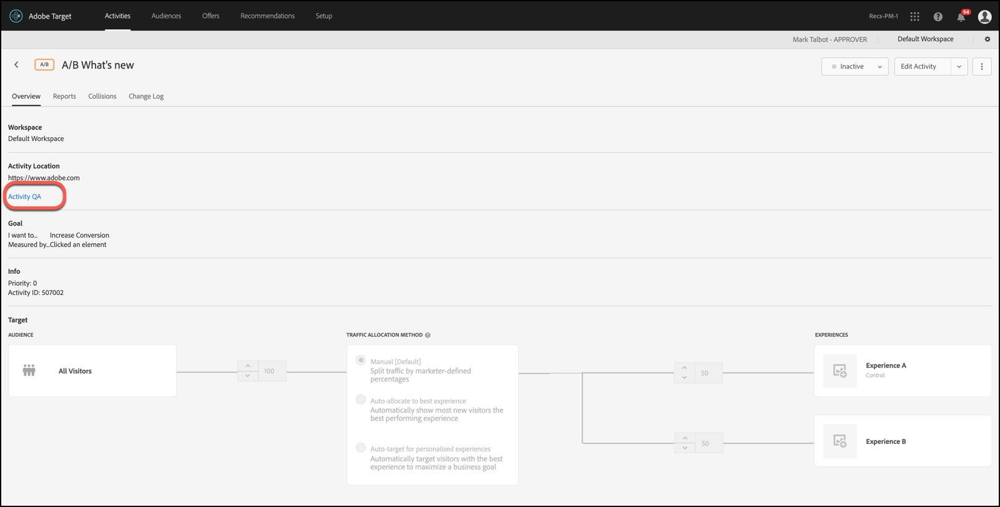
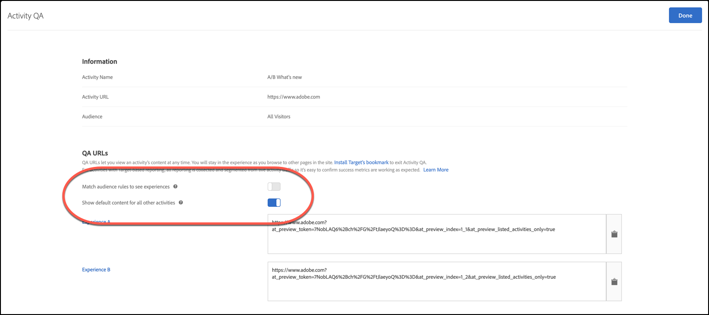

# Activity QA{#activity-qa}

Use QA URLs to perform easy end-to-end activity QA with preview links that never change, optional audience targeting, and QA reporting that stays segmented from live activity data.

## Overview {#section_11B761A522A14E61978275772210A4C2}

Activity QA lets you fully test your Target activities prior to launching them live. The Activity QA functionality includes:

* Links to share with team members that never change or require regeneration, regardless of updates made to the experiences or activities. This lets you fully test your activities across the entire user journey.
* Audience conditions optionally respected so marketers can test targeting criteria or ignore targeting criteria to QA the appearance of experiences without having to meet the audience conditions. 
* QA reporting is captured so that marketers can confirm that metrics are incrementing as expected and the QA report data is kept separate from production reporting (for non-A4T reporting). 
* The ability to preview an experience in isolation or in conjunction with other live activities satisfying the delivery criteria (page/mbox/audience). 
* The ability to QA the entire user journey. You can access your site once with the QA link and then browse the entire site while in Activity QA. You remain in Activity QA until you end the session or until you use the [QA Target bookmarklet](../../c-activities/c-activity-qa/activity-qa-bookmark.md#concept_A8A3551A4B5342079AFEED5ECF93E879) to force yourself out of Activity QA. This feature is particularly useful if you have an activity spanning multiple web pages.

## Accessing and Sharing a QA URL {#section_1C59BAA247B247BDB125D1BE8EAD4547}

1. From an activity's [!UICONTROL Overview] page (all types except Automated Personalization), click the **[!UICONTROL Activity QA]** link.

   

1. Configure the following settings:

   

    * **Match Audience Rules to See Experiences:** Sometimes you want to confirm that your audience matching works. Other times you just want to check the look and feel of the activity. If this setting is toggled to the "on" position, testers must meet targeting requirements to qualify to see the experiences. For Experience Targeting (XT) activities, a single activity URL is provided. The experience you see is determined by you qualifying for one of the targeting rules.

      If this setting is toggled to the "off" position, clicking the links show you the experiences regardless of whether you qualify or not. When performing QA, you can switch back and forth between requiring or not requiring that audience targeting is respected. 
    
    * **Show Default Content for All Other Activities:** If this option is toggled to the "on" position, default content is shown for all other activities (for example, the preview will be shown in isolation without considering all other live activities on the same page/mbox.

      If this setting is toggled to "off," consider the following:

        * If there are collisions between the activity you are testing and other live activities, [normal priority rules](../../c-activities/priority.md#concept_1780C11FEA57440499F0047DD6900E0F) apply. Because of this, it is possible you won't see the activity you are intending to QA. 
        * Metrics increment for the viewed activities, but only in the QA reporting environment.

1. Click **[!UICONTROL Done]** to save your changes. 
1. Share the Activity Link URLs with members of your organization for testing.

   Activity Links never expire and you do not need to resend links if someone makes changes to an activity or experience. However, if you apply a different audience from the Audience Library, rather than simply editing the activity, a new link is generated that you'll need to re-share.

   Each Activity Link URL (for Exp A, Exp B, etc.) lets you start the user journey from the corresponding experience. You can click the URL generated for an experience and then proceed with normal site browsing to see experiences on multiple pages (if multiple pages exist). Only one URL is generated per experience, even if the experience spans multiple pages (template testing or multi-page testing). You can navigate the site to see the other pages because the Activity QA is sticky. 

1. To see reports generated from Activity Link URLs, click the activity's **[!UICONTROL Reports]** page, click the **[!UICONTROL Settings]** icon (   ), then select **[!UICONTROL QA Mode]** from the **[!UICONTROL Environment]** drop-down list.

## Considerations {#section_B256EDD7BFEC4A6DA72A8A6ABD196D78}

* The [!UICONTROL Activity QA] link displays on the [!UICONTROL Overview] page of all activity types except for Automated Personalization (AP). You can use [Preview links](../../c-activities/t-automated-personalization/experience-preview.md#task_586C6655A6FD4AF08F5678FC3F481EFC) for AP activities. 
* Activity QA URLs are available with activities with Analytics as the reporting source (A4T). Hits generated while performing QA using Activity QA will flow to the same report suite where the activity's data will flow even after the activity goes live. 
* Activity QA does not display content for archived activities or activities that are past their end dates. If you deactivate an ended activity, you must save the activity again for Activity QA to work. 
* Activities imported into Target Standard/Premium (from Target Classic, for example) do not support QA URLs. 
* In Auto-Allocate, Auto-Target, and Recommendations activities, the model will not be affected by the visits captured in Activity QA. 
* Because Activity QA is sticky, after you browse a website in Activity QA, your Target session must expire or you need to have Target release you from Activity QA before you can view your site like a typical visitor. Use the [Target QA bookmarklet](../../c-activities/c-activity-qa/activity-qa-bookmark.md#concept_A8A3551A4B5342079AFEED5ECF93E879) to force yourself out of Activity QA.

  You can also manually force yourself out by loading a page on your site with the `at_preview_token` parameter with an empty value (for example, `https://www.mysite.com/?at_preview_token=`). 

* If you specified "URL is" while creating the activity [refinements in the Form-based Composer](../../c-experiences/form-experience-composer.md#task_FAC842A6535045B68B4C1AD3E657E56E) or [page delivery options in the Visual Experience Composer)](../../c-experiences/c-visual-experience-composer/viztarget-options.md#reference_3BD1BEEAFA584A749ED2D08F14732E81), the QA URL will not work because Activity QA appends URL parameters. To solve this issue, click the QA URL to go to your site, remove the appended parameters from the URL, then load the new URL. 
* 3rd-party cookies must be enabled in Safari browsers for Activity QA to work properly. 
* If an activity uses multiple experience audiences (for example, a US and UK site that are included in the same activity), QA links aren’t generated for the four combinations (Experience A/ US Site, Experience A/ UK Site, Experience B/ US Site, Experience B/ UK Site). Only two QA links (Experience A and Experience B) are created and users must qualify for the appropriate audience to see the page. A UK QA person couldn’t see the US site. 
* All `at_preview` parameters and values are already URL encoded. Most of the time, everything works as expected; however, some customers might have load balancers or Web servers that try to encode the query string parameters again.

  Because of this double encoding, when we try to decode the `at_preview_token`, Target can't extract the correct token value, resulting in preview not working.

  We recommend that you talk to your IT team to ensure that all preview parameters are white-listed so that these values are not transformed in any way.

  The following table lists the parameters that can be whitelisted in your domain:

  | Parameter | Type | Value | Description |
  |--- |--- |--- |--- |
  |`at_preview_token`|Encrypted string|Mandatory; no default value|An encrypted entity that contains the list of campaigns IDs that are allowed to be executed in QA mode.|
  |`at_preview_index`|String|Empty|Format of the parameter is `<campaignIndex>` or `<campaignIndex>_< experienceIndex>` Both indexes start with 1.|
  |`at_preview_listed_activities_only`|Boolean (true/false)|Default value: false|If "true," all campaigns specified in the `at_preview_index` parameters are processed. If "false," all the campaigns from the page are processed, even if they were not specified in the preview token.|
  |`at_preview_evaluate_as_true_audience_ids`|String|Empty|Underscore-separated ("_") list of segmentId-s that should always (at targetting and reporting level) be evaluated as "true" in the scope of the mbox request.|
  |`_AT_Debug`|String|Window or console|Console logging or new window.|
  |`adobe_mc_ref`|||Passes the referring URL of the default page to the new page. When used with `AppMeasurement.js` version 2.1 (or later), [!DNL Adobe Analytics] uses this parameter value as the referring URL on the new page.|
  |`adobe_mc_sdid`|||Passes the [!DNL Supplemental Data Id] (SDID) and [!DNL Experience Cloud Org Id] from the default page to the new page in order for Analytics for Target (A4T) to "stitch" together the Target request on the default page with the Analytics request on the new page.|

* The Target QA Mode UI shows just the first URL of an experience in a multi-page activity. The assumption is that you are creating a journey test and you will move from URL1 to URL2. However, if you want to go to URL2 independently, copy all the URL parameters provided against URL1 and apply them to URL2 after placing a "?" just like you see in URL1.